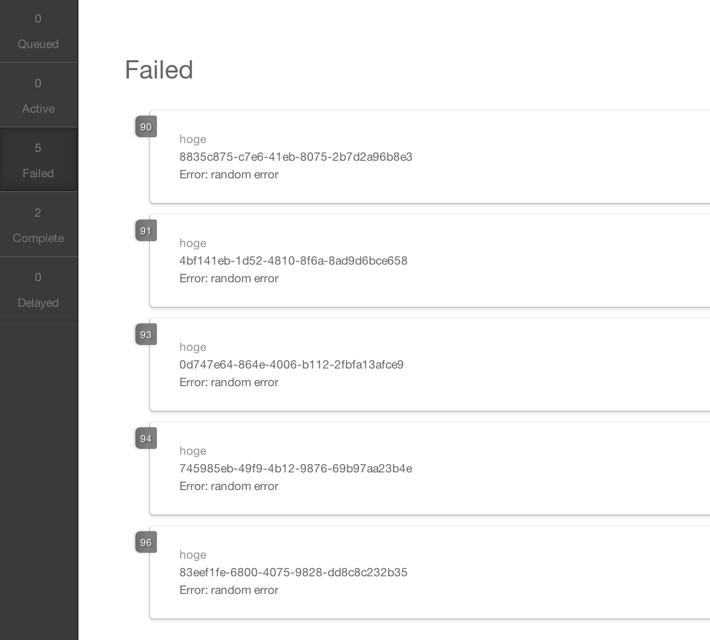

Sample Kue Worker / Server
------------------------------------------------------------

ベストプラクティスでは無いかもしれませんがとりあえず、こうやることで
一定の規律を持って様々な処理をWorkerに登録し、対応しています。

## kue とは

> Kue is a priority job queue backed by redis, built for node.js.
> 
> Kue は redis をバックエンドとした Queue です


* jobs は singleton

```
exports.createQueue = function ( options ) {
    if (!Queue.singleton) {
        Queue.singleton = new Queue( options );
    }
    events.subscribe();
    return Queue.singleton;
};
```

### 簡単な使い方紹介 (Readme.mdみれば書いてある)


### Web Client



## 競合

* [Bull](https://github.com/OptimalBits/bull)

### Pros

* `type` を通して producer と consumer を異なるサーバで行うことができる
* むしろBullなんでできないの？consumerとproducerを同じオブジェクトから処理するとか、辛い

### Cons

* (現状) Job の Expire を自動設定できない(Redis の保存形式に依存)

## Redis の内部形式


## 辛かったこと

* Worker の再起動時に Active が残る/貯まる
  * 処理中の job の完了を待ってなかったため
* Complete/Failが貯まる(膨大に)
  * Redis のメモリ圧迫
* Expire を打ち込めない
  * [setTimeoutの実装](https://github.com/LearnBoost/kue/issues/130#issuecomment-11346815) しかないぽい・・・
  * kue 落としたら消えないんじゃ・・・

## やったこと

* 各クライアントで kue.createQueue して Redis のコネクションが詰まることを懸念して REST API で登録
* 通信先/経路で落ちてくれれば リクエストの timeout で制御しやすく、ジョブ登録時にわかるから、ユーザに対してもリトライ処理の依頼や、そもそも調子悪いかの通知ができる

```
opt =
  url: "http://localhost:16379/job"
  method: "POST"
  form:
    type: "type"
    data: {}
request(opt, (err, body, res)->)
```

* Complete の job は削除 (運用してみて、結果、見ない)
* Failed は見るので削除しない

## 現在の運用上の実装

### REST Server

* これはあんまり特殊なことはしてないので割愛
* やってるのは Web App の起動と停止をちゃんと書いてるくらい

### Worker Daemon

* type 毎に起動するのはちょっとあれだったので、複数の type の Worker をひとつの WorkerDaemon で管理させたい

### Worker

* worker 殺すときに処理中の job が終わるのを待って死んで欲しい
* process の中で通信とかしだして、そこで死んだりしたら exception 拾えないから domain 使う
* worker を作る人は主な process 書くことだけに注力して欲しいので上のようなものができるガワを書いた
* Worker を書く人は extends して実処理を実装するだけ

```
class MyWorker extends Worker
  process: (job)->
    # なんかしょり
    # さいごに Promise を返せばいい
```    
    
* class Worker

```
module.exports = class Worker
  @uid: do ->
    id = 0
    -> id++

  #
  # ## constructor
  #
  # * @param  redis{Object}     optional
  #   * redis.host{String}      default "localhost"
  #   * redis.port{Number}      default 6379
  #   * redis.db{Number}        default 0
  #   * redis.auth{String}      default ""
  # * @param  options{Object}   optional
  #
  constructor: (@redis = {}, @options = {})->
    @id      = Worker.uid()
    @jobs    = null
    @ctx     = null
    @current = null

  #
  # ## process
  #
  # * @param  job{Object}       required
  #   * job.type
  #   * job.data
  # * @return {Promise({null|Error})}
  #
  process: (job)->
    # console.error "Worker: define class extends this"
    sleep(2000)
    .then(->
      if Math.random() < 0.
        throw new Error("random error")
      else
        null
    )

  #
  # ## subscribe
  #
  # * @param  type{String}      required
  # * @return {Worker}
  #
  subscribe: (type)->
    throw new Error("type required") unless type? and typeof type is "string"
    console.log "Worker(#{@id}): subscribes #{type}"
    @jobs = kue.createQueue(
      prefix: @options.prefix or "q"
      redis:
        host: @redis.host or "localhost"
        port: @redis.port or 6379
        db:   @redis.db or 0
        auth: @redis.auth or null
    )

    @jobs.process(type, (job, done, ctx)=>
      console.log "Worker(#{@id}): start  processing #{job.type}:#{job.data.title}"
      # ここで ctx と job を保持しておく (#close で利用する)
      @current =
        ctx: ctx
        job: job
      domain = Domain.create()
      domain.run =>
        @process(job)
        .then((result)-> done(null, result))
        .catch((err)-> console.log err; done(err))
        .finally(=>
          console.log "Worker(#{@id}): finish processing #{job.type}:#{job.data.title}"
          @current = null
        )

      domain.on("error", (err)->
        @current = null
        done(err)
      )
    )
    @

  #
  # ## close
  #
  # * @return {Promise({null|Error})}
  #
  close: ->
    d = deferred()
    # @current がなければ shutdonw して完了
    unless @current
      @jobs.shutdown((err)->
        return d.reject err if err
        d.resolve()
      )
      return d.promise

    # 突然の停止命令もちゃんと現在の job が終わってから死ぬ
    # @current があれば pause して、次が来ないようにしておく
    @current.ctx.pause((err)=>
      # @current の Job が完了するのを待つ
      @jobs.shutdown((err)->
        return d.reject err if err
        d.resolve(null)
      )
    )
    d.promise
```